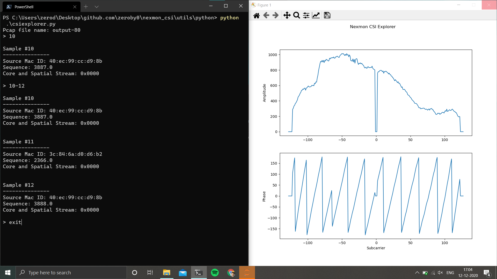

# CSI Explorer

A fast and simple CSI decoder written in Python.

You can:
- Plot CSI samples from .pcap files generated
- Read CSI samples to use in your Python programs

## Plotting

1. Install dependencies: `pip install numpy matplotlib`
2. Open the `config.py` file and select your WiFi chip. Default is bcm43455c0 (Raspberry Pi)
3. Copy your pcap files to the `pcapfiles` folder. This folder can be changed in the config file.
4. Run csi-explorer: `python3 csiexplorer.py`

Enter the pcap's filename. Typing the `.pcap` part is optional.
Type an index to show it's plot.
Type indexes separated by `-` to play animation (example: `10-20`).



Type `help` to see all options.
Null-subcarriers are hidden by default, you can change this in the config file.

## Using csi-explorer in your programs.

You can integrate csi-explorer into your python programs.
Here is an example for the 'Interleaved' decoder for bcm43455c0 and bcm4339,

```Python
from decoders import interleaved as decoder

samples = decoder.read_pcap('pcapfiles/example-80.pcap')

samples.csi # Access all CSI samples as a numpy matrix

# Get the 200th sample, but remove Null
# and Pilot OFDM subcarriers.
csi = samples.get_csi(
    index=200,
    rm_nulls=True,
    rm_pilots=True
)

mac = samples.get_mac(index=200)    # Source Mac ID
sc, fn = samples.get_seq(index=200) # Sequence and fragment number
css = samples.get_css(index=200)    # Core and Spatial Stream

samples.bandwidth # Bandwidth, automatically inferred from the pcap file
samples.nsamples  # Number of samples

# Print info about the 200th sample
samples.print(200)

```

## Authors
* [@Gi-z](https://github.com/Gi-z) - Glenn Forbes
* [@zeroby0](https://github.com/zeroby0) - Aravind Voggu
* [@tweigel-dev](https://github.com/tweigel-dev) - Thomas Weigel